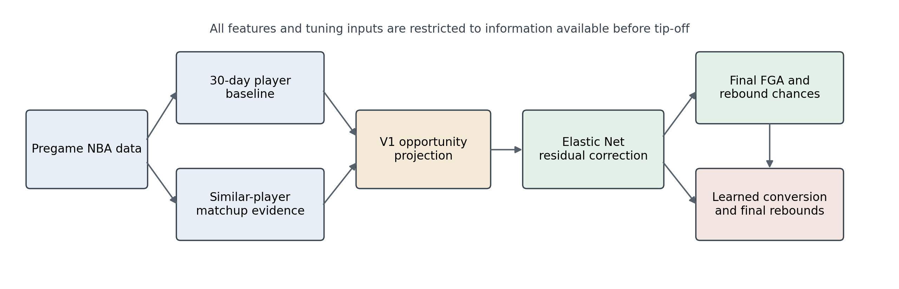

# NBA Player Opportunity Forecasting

[](https://github.com/Keezey/nba-player-opportunity-forecasting/actions/workflows/tests.yml)
[](https://www.python.org/)
[](LICENSE)

A leakage-controlled Python pipeline for forecasting an NBA player's
field-goal attempts (FGA), rebound chances (RC), and rebounds (REB) for a
specific regular-season matchup.

The project combines an interpretable recent-form and similar-player matchup
baseline with Elastic Net residual learning. The five-season warehouse contains
131,279 player-game records; the final eligible 250-player modeling cohort
contains 59,156 rows from the 2021-22 through 2025-26 regular seasons.



[Read the research report](docs/research_report.pdf) or inspect its
[LaTeX source](docs/RESEARCH_REPORT.tex).

## Results

The selected V2.3 opportunity model was evaluated with rolling, chronologically
held-out seasons. The table reports equal-season mean absolute error (MAE), so
each of the 2023-24, 2024-25, and 2025-26 test seasons receives equal weight.

| Output | V1 MAE | V2 MAE | Relative improvement |
| --- | ---: | ---: | ---: |
| FGA | 3.136 | 3.062 | 2.36% |
| Rebound chances | 3.063 | 2.934 | 4.22% |
| Rebounds using recent conversion | 2.122 | 2.066 | 2.64% |

A separate learned rebound-conversion adjustment reduced the complete-season
rebound MAE from `2.065` to `2.047`, an additional 0.86%, and improved it by
1.23% when projections were conditioned on approximately normal minutes.

These are single-game point forecasts, not guarantees. The system does not
currently ingest real-time injury or lineup news and does not produce calibrated
prediction intervals.

## Method

1. **Recent baseline:** Use up to 30 days of pregame history and retain games
   near the target player's usual workload.
2. **Similar players:** Compare players using minutes, FGA/minute, rebound
   chances/minute, usage, touches/minute, listed position, and starter rate.
3. **Opponent adjustment:** Measure how the closest eligible players performed
   against the exact opponent, bound extreme ratios to `0.50-1.50`, and shrink
   low-sample evidence toward the neutral multiplier `1.00`.
4. **Residual learning:** Use Elastic Net models to correct systematic FGA and
   rebound-chance errors, then estimate rebounds from corrected chances and a
   learned rebound-conversion adjustment.

All features obey a strict pregame cutoff. The target game's outcome is attached
only after its feature row has been constructed and validated.

## Repository Contents

```text
src/                    V1 and V2 modeling modules
scripts/                data, experiment, training, and inference commands
tests/                  offline unit and integration tests
docs/RESEARCH_REPORT.tex manuscript source
docs/MODEL_CARD_V2.md   intended use, results, and limitations
docs/REPRODUCIBILITY.md complete rebuild and experiment sequence
docs/API_ENDPOINTS.md   NBA Stats endpoint and schema decisions
docs/figures/           manuscript figures
artifacts/v2.3.0/       final model bundles and public-safe manifests
```

Raw NBA data, cached API responses, processed datasets, intermediate models,
and generated experiment outputs are written locally to `data/`, `models/`,
and `reports/`. These directories are intentionally excluded from Git and are
created automatically when needed. The two final models and their manifests
are included under `artifacts/v2.3.0/`.

## Installation

Python 3.13.2 was used for the finalized research release.

```bash
git clone https://github.com/Keezey/nba-player-opportunity-forecasting.git
cd nba-player-opportunity-forecasting

python -m venv .venv
source .venv/bin/activate
python -m pip install --upgrade pip
python -m pip install -r requirements.txt
```

On Windows, activate the environment with `.venv\Scripts\activate`.

## Quick Start

Run the interpretable V1 workflow for a historical player-game using only a
player name and date:

```bash
python -m scripts.predict_player "Amen Thompson" 2026-04-07
```

The command resolves the player ID, game, opponent, and season; constructs the
pregame baseline; selects comparison players; and returns FGA, rebound-chance,
and rebound projections. An internet connection is required for uncached NBA
Stats requests.

Run the packaged V2.3 all-games model:

```bash
python -m scripts.predict_player_v2 \
  artifacts/v2.3.0/v2_3_250_all_games.joblib \
  "Amen Thompson" \
  2026-04-07
```

The all-games artifact is the default model. The separately trained
normal-minutes artifact answers a conditional question and does not predict
whether normal minutes will occur.

For repeated analysis, optionally build a local regular-season warehouse:

```bash
python -m scripts.build_historical_store 2025-26
python -m scripts.historical_store_status
```

## Reproduce The Research

The complete sequence is documented in
[docs/REPRODUCIBILITY.md](docs/REPRODUCIBILITY.md). It covers:

- rebuilding the five-season historical warehouse;
- constructing the reproducible 250-player target pool;
- generating leakage-safe historical training rows;
- running pool-size, rolling-season, normal-minutes, robust-bound, and
  rebound-conversion experiments; and
- fitting the final all-games and normal-minutes artifacts.

The endpoint fields and caching decisions are documented in
[docs/API_ENDPOINTS.md](docs/API_ENDPOINTS.md). Model scope and limitations are
summarized in [docs/MODEL_CARD_V2.md](docs/MODEL_CARD_V2.md).

## Tests

The test suite is offline and does not require live NBA requests:

```bash
python -m pytest -q
```

GitHub Actions runs the same command for every push and pull request.

## Data And Responsible Use

Data are retrieved from NBA Stats through the unofficial
[`nba_api`](https://github.com/swar/nba_api) wrapper. Users must follow the
applicable data-provider terms. Endpoint availability and schemas may change.

This project is intended for research, education, and historical analysis. It
is not an injury-news service, a guarantee of player performance, or a complete
wagering system.

## License

The source code is released under the [MIT License](LICENSE). This license does
not grant rights to NBA data, trademarks, or third-party content.
